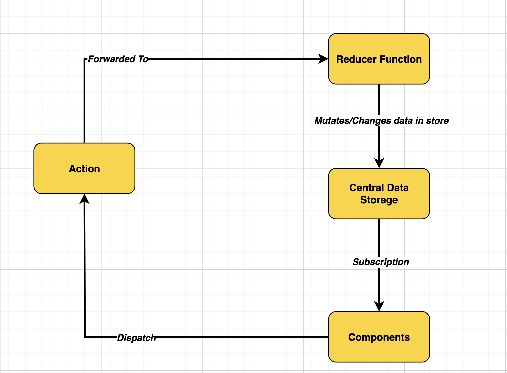
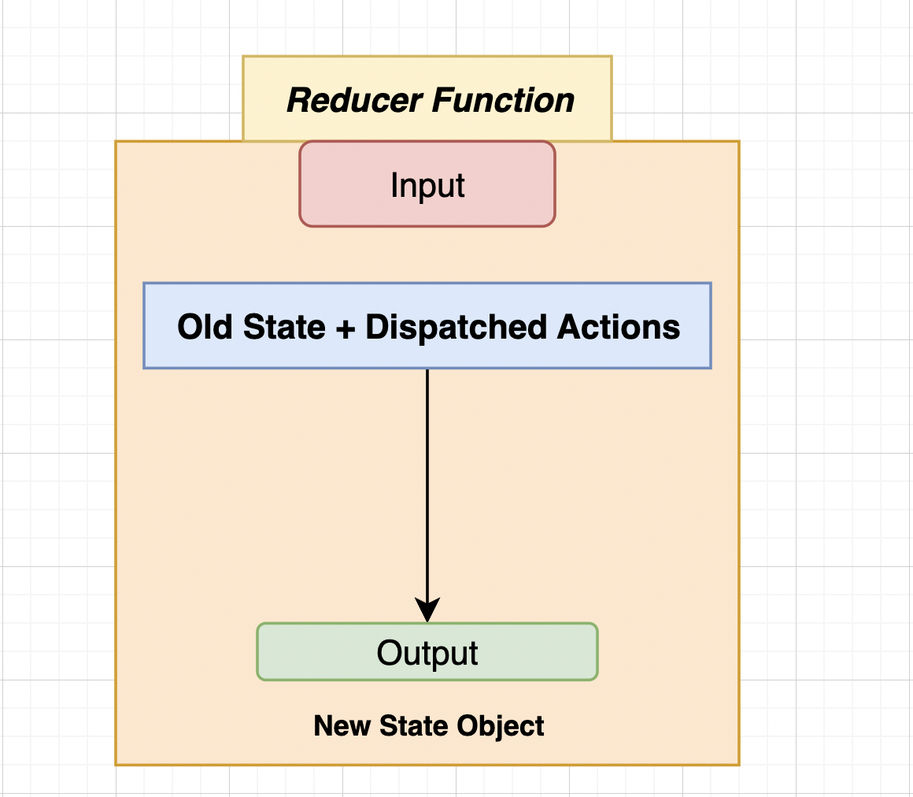

# Redux with JavaScript and Node.js

## Setup Instructions

Since we are using **Redux** with **JavaScript** and running it with **Node.js**, follow these steps to set up the project:

### 1. Initialize a New Node.js Project
Run the following command to create a `package.json` file:

```sh
npm init -y
```

### 2. Install Redux
Install Redux using npm:

```sh
npm install redux
```

## Core Redux Concepts

The following diagram illustrates the core concepts of Redux:



## Explanation of Redux Flow

1. **Component** dispatches an **Action**.
2. The **Action** is forwarded to a **Reducer**.
3. The **Reducer** processes the action and returns a new state based on the previous state and the action.
4. The **Component** subscribes to the store and gets updated data.

This setup helps manage the application state efficiently and predictably.

---
## Reducer Function

A **Reducer function** in Redux is a pure function that takes two parameters:

1. **Previous State** - The existing state before the action is applied.
2. **Action** - The dispatched action that carries a type and optional payload.

The reducer determines how the state should change in response to the action and returns a **new state**.

### Important Characteristics of a Reducer Function:
- It must be a **pure function** (no side effects, no API calls, no modifying external state).
- It should **return a new state** instead of mutating the existing one.
- It should always handle the default case when an unknown action type is received.

### Example Reducer Function:

```js
const initialState = { count: 0 };

function counterReducer(state = initialState, action) {
  switch (action.type) {
    case "INCREMENT":
      return { ...state, count: state.count + 1 };
    case "DECREMENT":
      return { ...state, count: state.count - 1 };
    default:
      return state;
  }
}
```



For more details, visit the official [Redux documentation](https://redux.js.org/).
